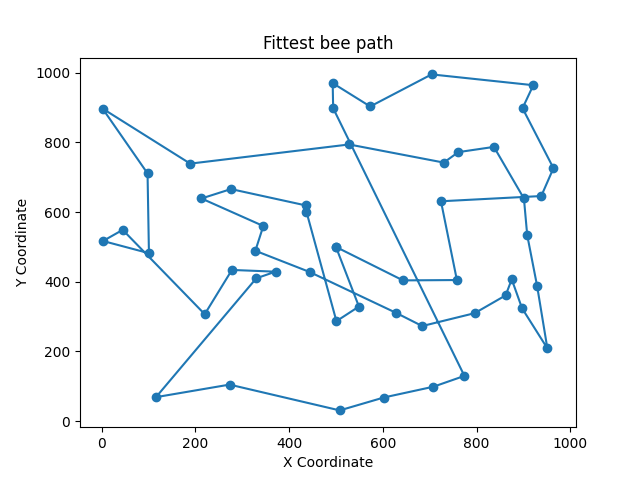

# Bee Foraging Path Optimization Using Genetic Algorithm

## Overview
This project applies a Genetic Algorithm to solve a combinatorial optimization problem similar to the **traveling salesman problem**. 

The objective is to optimize the foraging path of bees, ensuring they collect nectar from all flowers in a field in the least time possible, starting and ending at their hive located at coordinates (500, 500).

## Key Concepts
- **Genes**: Represent points (flower and hive coordinates) in a bee’s flying path. Hive coordinates are fixed at the start and end of the chromosome.
- **Chromosomes**: Sequences of genes depicting a complete foraging path.
- **Population**: A group of various foraging paths taken by the bees.
- **Fitness Function**: Evaluates bee's path efficiency based on the total distance.
- **Euclidean Distance**: Used in fitness function to calculate distances between points on the path. The distance `d` between two points `(x1, y1)` and `(x2, y2)` in 2D Cartesian coordinates is given by the formula:

$$
d = \sqrt{(x2 - x1)^2 + (y2 - y1)^2}
$$

## Genetic Algorithm Components
- **Pairs Selection**: Top 50 fittest bees are chosen for crossover. Roulette wheel selection is used, where a bee's chance of selection is proportional to its inversed fitness (because smaller is better).
- **Crossover ([Partially Mapped Crossover](https://github.com/ruta-tamosiunaite/partially-mapped-crossover) - PMX)**: Two parent chromosomes are combined to create offspring. Segments between two chosen crossover points are swapped and duplicates are resolved using a mapping approach.
- **Mutation (Place Change)**: Random changes in a path to explore new possibilities. Mutation rate determines the magnitude of change. Higher rates move a gene more significantly to the left or right in the chromosome.
- **Updating Population**: Population is updated by replacing less fit ancestors with fitter offspring. The combined population and offspring are sorted, and the top 100 individuals are selected for the next generation.

## Files
- **Main.py**: Controls the algorithm flow and contains parameters.
- **Beehive.py**: Hosts the `Bee` and `Beehive` classes. The Beehive class manages the bee population and oversees their evolution through generations.
  
  
## Results Overview

### Initial Setup
- **Population**: Start with a random initial population of 100 bees.
- **Crossover**: Implement roulette wheel selection for choosing parent bees. Each selected pair produces two children, contributing to the next generation.
- **Selection**: After crossover, select the 100 fittest bees to form the new generation.

### Mutation Strategy
- **Initial Mutation Rate**: 1 (neighbouring genes swap places).
- **Initial Mutation Frequency**: 3 (three swaps per new bee's chromosome).

### Adaptive Mutation
- **Fittest Bee Stagnation**: If the fittest bee per generation remains unchanged, increase the mutation frequency by 1 and the mutation rate (enabling gene swap over more than one position to the left or right).
- **Average Fitness Stagnation**: If the average fitness per generation remains the same for two consecutive generations, increase the mutation frequency by 1.

### Visualizations
- Fittest Bee Path: 
- Fitness Over Generations: 
