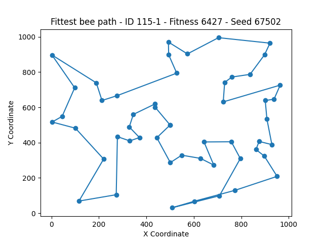

# Bee Foraging Path Optimization Using Genetic Algorithm

## Overview
This project applies a Genetic Algorithm to solve a combinatorial optimization problem similar to the **traveling salesman problem**. 

The objective is to optimize the foraging path of bees, ensuring they collect nectar from all flowers in a field in the least time possible, starting and ending at their hive located at coordinates (500, 500).

## Key Concepts
- **Genes**: Represent points (flower and hive coordinates) in a bee’s flying path. Hive coordinates are fixed at the start and end of the chromosome.
- **Chromosomes**: Sequences of genes depicting a complete foraging path.
- **Population**: A group of various foraging paths taken by the bees.
- **Fitness Function**: Evaluates bee's path efficiency based on the total distance.
- **Euclidean Distance**: Used in fitness function to calculate distances between points on the path. The distance `d` between two points `(x1, y1)` and `(x2, y2)` in 2D Cartesian coordinates is given by the formula:

$$
d = \sqrt{(x2 - x1)^2 + (y2 - y1)^2}
$$

## Genetic Algorithm Components
- **Pairs Selection**: Selection is based on a roulette wheel method, where selection likelihood is inversely proportional to bee fitness, favoring those with smaller fitness values. A flattening formula $$ y = 1000 / x $$ is applied to moderate selection bias.
- **Crossover ([Partially Mapped Crossover](https://github.com/ruta-tamosiunaite/partially-mapped-crossover) - PMX)**: Two parent chromosomes are combined to create offspring. Segments between two chosen crossover points are swapped and duplicates are resolved using a mapping approach.
Each selected pair produces one fitter child, potentially contributing to the next generation.
- **Mutation**: Enhances bee path efficiency by reordering the chromosome using proximity data.
  - `mutation_rate` indicates the number of genes (flowers) to consider for mutation. 
  - A dictionary `distances_table` contains the two closest points to each location. 
  - Rearrangement strategy:
    - Closest point          -> Neighbour to the right
    - Second Closest point   -> Neighbour to the left

- **Updating Population**: Population is updated by replacing less fit ancestors with fitter offspring. The combined population and offspring are sorted, and the top 100 individuals are selected for the next generation.
  
- **Stopping the script**: Halt the generations when the chromosomes of the first and last bees in a sorted population are identical, signaling that *all bees are the same and further improvement is unlikely*.
  

## Files
- **Main.py**: Controls the algorithm flow and contains parameters.
- **Beehive.py**: Hosts the `Bee`, `Beehive` and `BeesArchive` classes. The Beehive class manages the bee population and oversees their evolution through generations. The Bees Arhive class  
  
  
## Results Overview

### Initial Setup
- **Population size**: Random initial population of 100 bees.
- **Number of generations**: 150
- **Crossover**: Select all 100 bees for crossover.
- **Initial Mutation Rate**: 5
- **Adaptive Mutation**: If the fittest bee per generation remains unchanged or the average fitness per generation remains the same for two consecutive generations, increase the mutation rate by 1.

  

## Insights

- **Population selection for crossover** - Optimal reproduction outcomes are achieved by selecting **all bees**, not the TOP 50. This approach ensures higher chromosome variation and controlled convergence.
  
- **Initial population strategy** - For the Traveling Salesman Problem, initializing with a fit population leads to significantly improved results (distance of ~5500) but causes rapid convergence and homogeneity. Introducing random chromosomes does not notably enhance outcomes.

  >Enhancing initial population diversity may involve using **point clusters** - defining the paths both start and end simultaneously, originating from the beehive and exploring different cluster combinations for path construction. A random flower from each cluster is selected for the initial path, promoting variety though it may not necessarily surpass existing method.

- #### **Mutation Refinement**: Mutation could be improved by considering the spatial area between two flowers, A and B. If any flowers within a defined width of the line from A to B aren't between them in the chromosome, the path is rearranged to include the nearest of these flowers to A. This process starts with a minimal skip between A and B and adjusts dynamically, with the maximum width being the distance between A and B.